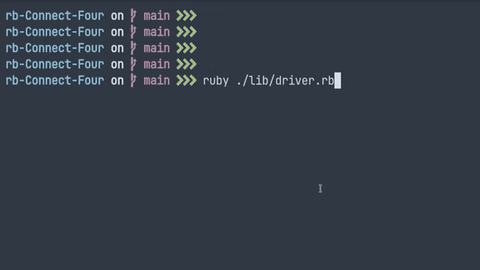

# rb-Connect-Four

A command line connect four game made completely with ruby while practicing TDD
This was a part of The Odin Project curriculum. [click here](https://www.theodinproject.com/lessons/ruby-connect-four#project-tdd-connect-four) to check it out the project specs.

## Play it yourself

[Click here](https://replit.com/@SankalpGawali/rb-Connect-Four#) for a live version!

Or clone the repo and run driver.rb to play it locally.

## Project features

1. The entire project was made with a TDD workflow
2. Uses the colorize library for colored coins
3. All logic methods have tests written with rspec
4. Simple menus to allow easy navigation
5. Contains an ingame options menu to change some visual options

## Overview and Thoughts

1. As it was my first time properly using tests and strictly following TDD it was certainly a challenge, and I definitely  put in some extra time and effort into it

2. This is also the project where i decided to correctly modularize my code and try to maintain cleanliness, its not perfect yet but its a significant improvement compared to my previous projects.

3. Overall I enjoyed working on this project and learnt a lot along the way.

4. The unicode circles seem to act weird in my console so i felt the need to add an option to change them.
